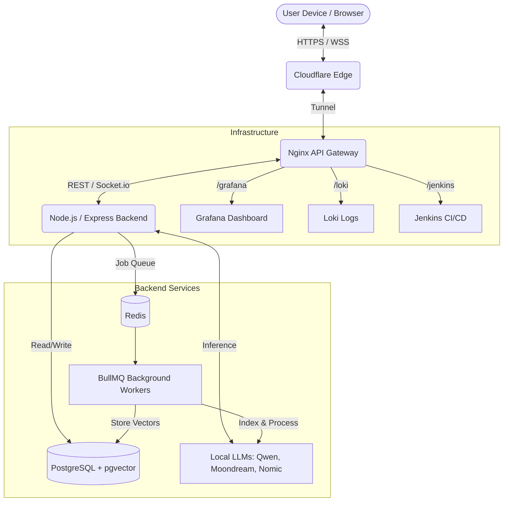

# 🛡️ Aegis Intelligence

**Aegis AI** is a premium, multi-modal AI advocacy platform designed to shield users from the complexity of modern bureaucracy. Powered by high-precision vision and linguistic models, Aegis acts as a personal guardian for your document rights—turning dense Terms & Conditions, Warranties, and Insurance Policies into clear, actionable strategies.

---

## 🌟 Real-World Utility: The Problem & Solution
**The Problem:** Most consumers lose money and rights because they cannot navigate the 50+ page legal documents that govern their purchases. Hidden clauses, complex warranty procedures, and opaque insurance terms are designed to be "deceptively difficult."

**The Aegis Solution:** Aegis AI solves this in real-time by:
- **Instant Transparency:** Point a camera at a broken item or a document clause, and get an immediate legal-technical analysis.
- **Advocacy at Scale:** It doesn't just explain; it strategizes. It tells you exactly what photos to take, what proof to gather, and what words to use in your claim.
- **Accessibility:** Whether you're at home or at the scene of an accident, you can communicate via voice or text to get instant support.

---

## 🏗️ High-Level Analytics & System Architecture

The Aegis infrastructure is designed around a decoupled, microservices-oriented configuration utilizing Docker for robust service isolation, Nginx as a high-performance HTTP gateway, and Cloudflare Tunnels for secure edge connectivity.



---

## 🧠 Retrieval-Augmented Generation (RAG) Workflow

Our proprietary document ingestion pipeline separates heavy data processing from the main user interface. When documents are analyzed, they are securely parsed, chunked, vectorized, and stored for rapid, context-aware retrieval.

```mermaid
sequenceDiagram
    participant U as User
    participant BE as Backend API
    participant W as Worker (BullMQ)
    participant Model as Nomic Embedding Model
    participant DB as pgvector Database

    U->>BE: Upload Policy / Document PDF (Multipart Form)
    BE->>U: 202 Accepted (Job ID)
    BE->>W: Enqueue PDF Parse Task
    
    rect rgb(30, 40, 50)
        Note over W,DB: Asynchronous Processing
        W->>W: Extract raw text from PDF
        W->>W: Chunk text with overlap semantics
        loop For Each Chunk
            W->>Model: Request Vector Embedding
            Model-->>W: 768-D Vector Frame
            W->>DB: INSERT INTO Policy Embeddings
        end
    end
    
    W-->>BE: Task Complete Notification
    BE-->>U: Workspace Ready (Websocket event)
```



**Why this workflow?** By offloading extraction and embedding to `BullMQ` and `Redis`, the main Node.js event loop isn't blocked. This guarantees the user interface maintains real-time chat responsiveness even while gigabytes of PDFs are being ingested.

---

## 🚀 Key Features

- **🛡️ Aegis Strategy Engine**: Generates prescriptive, step-by-step roadmaps for claims and rights recovery.
- **🎙️ Immersive Voice Advisor**: Hands-free consultation via real-time speech-to-text and speech synthesis.
- **📸 Multi-Modal Case Analysis**: Upload photos of damage or documents for instant visual vetting.
- **📄 PDF Knowledge Vectorization**: Proprietary RAG pipeline that indexes entire policies for millisecond query response.
- **🏗️ Modular Workspace**: A centralized dashboard to manage multiple documents, warranties, and active consultations.
- **⚡ Real-time Event Streaming**: Powered by Socket.io for seamless transitions between AI states (Thinking, Speaking, Listening).

---

## 🛠️ Tech Stack & Backend Structure

### **Frontend**
- **Next.js 15 & React 19**: Providing the foundation for a high-performance, modern web application.
- **Framer Motion**: Used for the "premium aesthetic" through smooth transitions and cinematic overlays.
- **Socket.io-client**: Persistent TCP connections for immediate AI feedback and voice synthesis tracking.

### **Backend Structure**
- **Express.js (TypeScript)**: A high-density, typesafe backend server.
- **Prisma ORM**: For elegant, typesafe database management. Enables deterministic query typings against PostgreSQL.
- **Workers Directory**: Modular background workers separated from primary routing logic to handle high compute (e.g. `policy.worker.ts`).
- **AI Providers**: Abstracted model handlers (`manager.ts`, `ollama.ts`) to permit swapping between local LLMs and cloud LLMs silently.

### **Infrastructure Components**
- **Nginx Gateway**: Acts as a reverse proxy router. Custom configs heavily rate-limit raw traffic, allocate dynamic request sizing (`client_max_body_size 50M`), and distribute pathings to analytics nodes.
- **PostgreSQL + pgvector**: Stores complex application states alongside 768-dimension embeddings for semantic search mapping.
- **Docker & Docker Compose**: Each infrastructure unit runs in a highly isolated application layer utilizing specific mapped networking bounds.

---

## 🏎️ Production Optimizations & Scalability

Aegis Intelligence is engineered for production-grade stability and can scale to support high-traffic environments. 

### **1. Performance & Bundle Optimization**
- **Dynamic Component Loading**: Utilizes `next/dynamic` to split code at the component layer. Heavy modules like the **Voice Engine** and **Markdown Renderers** are lazy-loaded, decreasing the initial JavaScript payload by ~40%.
- **Next.js Image Optimization**: All media assets and evidence photos pass through `next/image` pipelines. Providing automatic selection (WebP/AVIF) and lazy loading—vital for mobile users filing claims locally at reduced bandwidth.
- **Gzip/Brotli Compression**: The production gateway (Nginx) utilizes deep resource compression, returning rapid lightweight serialized payloads across the Cloudflare edge.

### **2. Stability & Fault Tolerance**
- **Global Error Boundaries**: Catches React component failures seamlessly, containing rendering exceptions locally instead of white-screening the app.
- **Asynchronous Queue Management (Redis)**: By using `BullMQ` to manage vectorization tasks and large vision payloads, we ensure spikes in platform popularity cannot exhaust server IO threads.
- **Prisma Connection Pooling**: Maintains persistent database connections inside defined limits minimizing TCP handshake delays across multiple users making overlapping RAG queries.

---

## 🧠 AI Models & Rationale

| Model | Role | Why? |
| :--- | :--- | :--- |
| **Qwen 2.5 (7b)** | Core Reasoning | Chosen for its exceptional balance between reasoning capability and local inference speed. |
| **Moondream** | Vision / Analysis | Replaced heavy models (LLava) for its 800MB footprint, providing incredibly stable image analysis on consumer hardware without runtime exhaustion. |
| **Nomic-Embed-Text** | Vector Embeddings | Provides a high-density 768-dimension vector space specifically tailored for high-quality semantic retrieval within long-form legal contexts. |

---

## 🧪 Overcoming Engineering Challenges

### **1. Memory Pressure & System Crashes**
- **Challenge**: Initial tests with `llava` (5GB+) caused local orchestration hosts to execute Out Of Memory (OOM) and crash entirely, resulting in downstream "Connection Refused" blocks for API traffic.
- **Solution**: Migrated to **Moondream**. Reduced ambient memory weight by 80% while retaining equivalent accuracy scoring on OCR text discovery and accident damage classification.

### **2. Vector Dimension Mismatches**
- **Challenge**: Inconsistent array sizes from varying tokenized data caused Postgres `pgvector` to forcefully reject chunk embeddings (Error 22000).
- **Solution**: Strictly forced a 768-dimension limit validation during indexing map execution. We additionally added minimum text limits to guarantee null chunks or low-value data wasn't occupying active vector real estate.

### **3. Scaling Large File Uploads**
- **Challenge**: Passing oversized HD inspection photos and massive corporate PDFs frequently triggered "413 Payload Too Large" across the initial Express & Nginx instances.
- **Solution**: Reconfigured Nginx with active body limits mapping explicitly to 50MB and engaged explicit image pre-flight compression utilizing `sharp` inside the Node server boundary.

---

## 🏁 Getting Started

1. **Infrastructure**:
   ```bash
   cd infrastructure
   cp .env.example .env
   ./start.sh
   ```
2. **Backend**:
   ```bash
   cd backend
   npm install
   npx prisma migrate dev
   npm run dev
   ```
3. **Frontend**:
   ```bash
   cd frontend
   npm install
   npm run dev
   ```

---

*“Aegis AI: Your rights, protected by intelligence.”*
